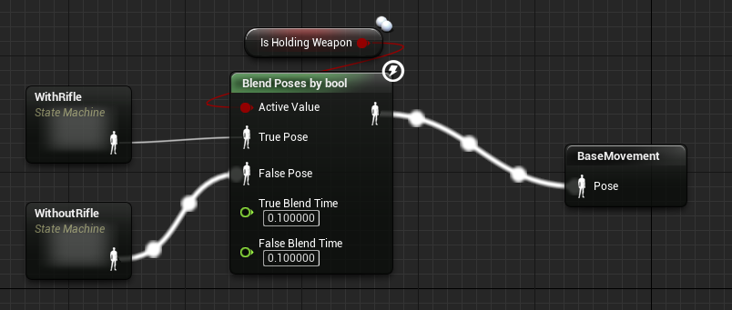
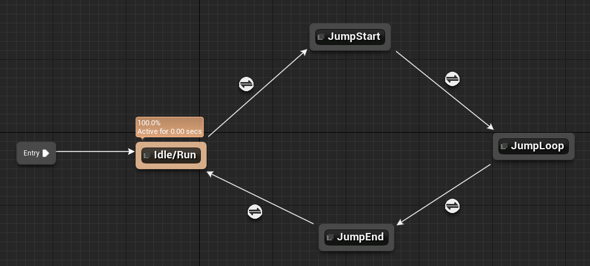
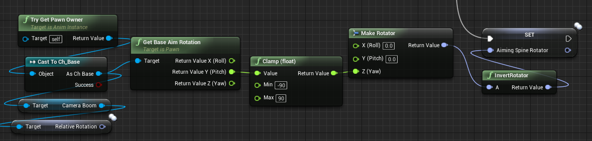
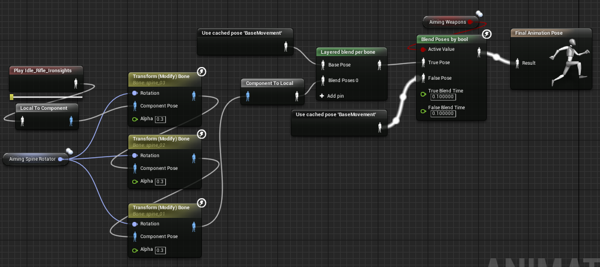

## Introduction

This report will cover an explaination on the physics and animation parts of the project. This was mainly split up into two tasks. The ragdoll and animation of the enemies and the animation for the characters. Leyla was given the enemies as she was mainly focused on the AI for them. While I focused on the characters to make sure that the characters could hold a weapon and move the way that looked right. 

So when designing how the characters should move and look we came up with a problem. This problem was how to make the player explore and see the beautiful landscape as well as being able to focus on enemies and ingage in combat. We solved this by having a free rotational camera around the character controlled using the cameras boom arm. This allows for exploration and then we would narrow and change the field of view on aiming and shooting. 

## Animation Blending 

In the initial stages we decided to use Unreal's starter content to get the animations working with the mannequin. This meant we had to blend and change the bones to match the movement we wanted to achieve. This was done by creating two blend space blueprints. This allows you to select how much of each animation you want to lerp between. This makes changes from idle to walking to sprinting very easy to do. We had a base movement for both when carrying a gun and not carrying a gun. This was stored in a animation cache. The reason for this is we have to use that basemovement to adapt it down the line. It meant storing one version of it instead of multiple. 

After we had got the base movement when holding or not holding a gun, we started to calculate the rifles aiming depending on the bool stored from the character's player controller, isplayerADS. We take the basic idle animation for animing down the iron sights of the gun. We then take the aiming spine rotator variable that we create in the event graph. This then effects each spine bone by a third to get a smoother look and curve in the back. After we have deformed the basic idle aim we layer the animation with the base movement cache. This means that if we are running and aiming it uses the legs to run and the body to aim. The bone which serperates the animations is the lowest spine bone. 

After we have an aiming animation we blend by a bool. This switchs between having the standard base movement or the newly calculated base movement with aiming. This is then past to the Final animation state for the pose.  

## Skeleton Sockets 

To get the weapons in the hands of the characters we used skeleton sockets which add's a point which we can access easily. This means that we can add and remove weapons just by accessing on node instead of getting the bones of the character and applying the weapon to those instead. This proved more difficult then normal as the weapons we not centered correctly on the pivot points. This meant that it would conflicted with Leyla's pick up collision box. I solved this by we centering the pivot point on the handle of the weapon. This makes appling weapons and ofsetting them for each character far easier then before. 

