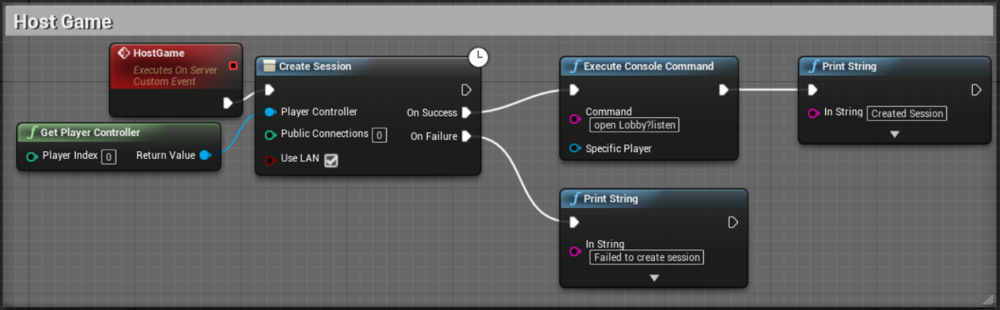
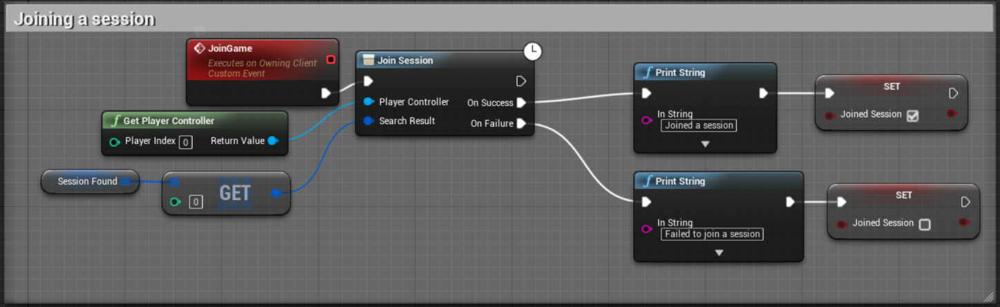
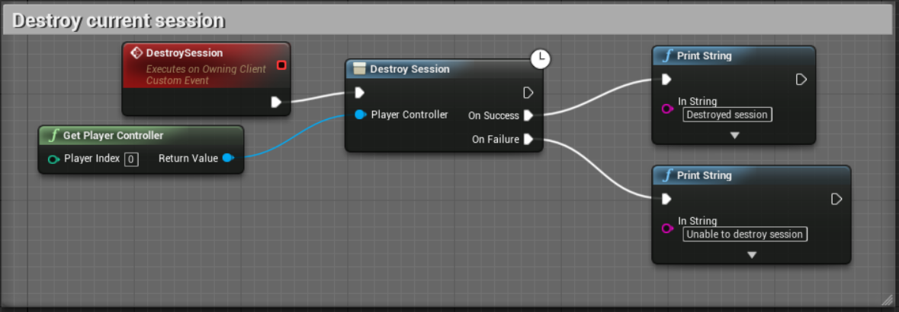
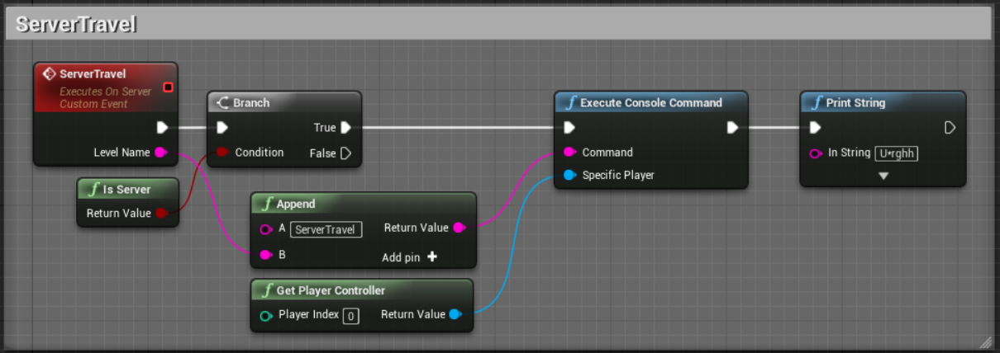
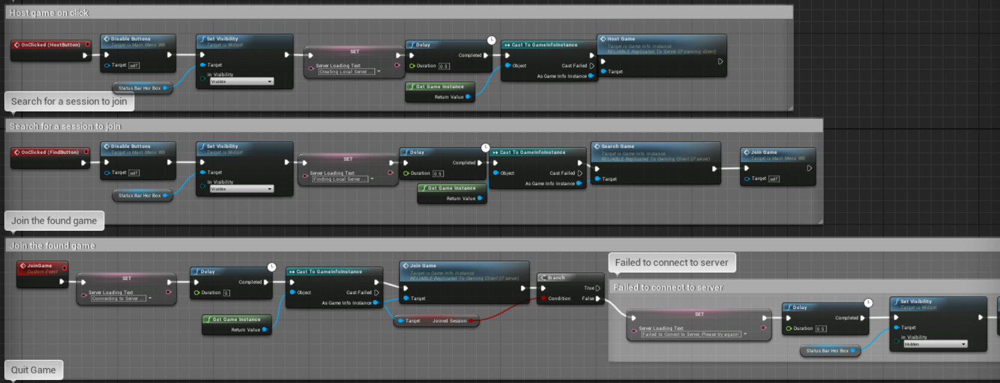
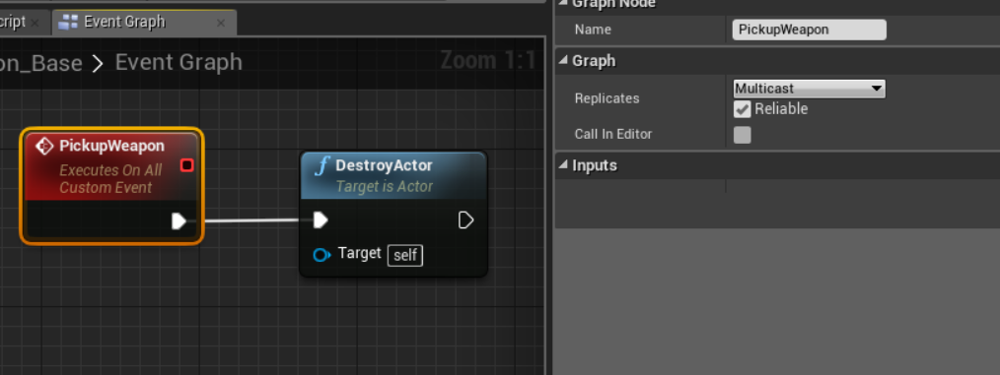
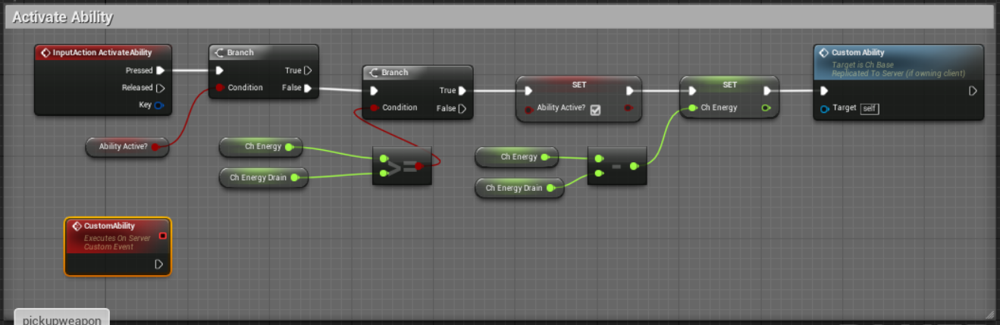
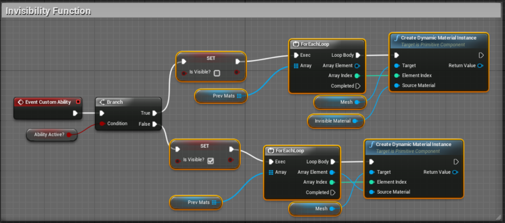

# Brief 
The specification of this project was it had to meet the follow criteria. 
- Lan or Wan multipler. 
- Third Person Character. 

# Introduction
In the initial design meetings we had focused mainly on a CO-OP based game as that was the types of games played by the team.
We had chosen a massive scope with lots of different features and systems that we could impletement to make this survival type game.
We refined this into a more managable size. The overall workings off the group and the features that were cut will be explained in 
a later section. 

This game would take place in two different maps and would be a short mission to demonstate the type and game that we would be creating.
The old city was the characters main home and we had to survive and bring aid to those who needed it from the fallout of the Genesis AI 
who now controlled the world. Within the old would we would have a market place to trade your goods and upgrade your weapons. This would
also be the main place of receiving new missions from various characters. 

This report will cover the features that I personally implemented and how the project went over all from a programatic point of view. 
For all other features within this game please read the other reports by other programmers. Links will be provided below.   

# Features Implemented 

When we started the project we spilt up the three main problems that we had to overcome. These were Lan connectivity, Third person controls 
with accurate firing and an enemy AI. Leyla had started on the enemy AI, Louis the Third person controls and I started on the Lan. Thoughtout
the project we had weekly meetings which we would talk about what was happening within the project and to rearrange tasks to suit our team. 
Overall these features were relatively seperate from each other. Over the project these were the feature that I implementated. 

- Lan Connectivity
- Character Classes for each character inherited from a base character 
- Characters controls and weapon aiming and firing
- Characters Abilities main the base function
  - Eagle vision
  - Invisibility 
- User Interface with the functionality attached
- Weapons with a base class and inherited weapon types. 

## Lan Connectivity

As one of the core criteria for the game we decided to focus on this from the start of the project. This was my original task whick was a lot bigger then we initially planned for. When we started the Unreal tutorial on networking with the Steam subsystem was promising and covered all of the aspects of character selection, session setup and server travel. This long tutorial turned out to waste a lot of time as it was not currently working with the latest version of Unreal as they have changed the way of connecting thought steam from 4.10 to 4.13 version of Unreal Engine 4. After this was found out to be the case. I decided to strip out all of the Steam networking and start again with the Lan only setup which did not need the steam subsystem plugin. 

This approach of building the session and taloring it to the game and how we wanted it to flow worked a lot better. We quickly got it up and running with the base characters moving around and replicating over both the client and server. However it was too late to change over a lot of the systems that were already implemented as a different structures was needed to work with storing data on only the server and getting the client to ask for events that they want to perform. This was changed in the weapon pick up class and character aiming ofsets as an example of how it should work if we designed the project with the multipler setup in mind.

Within Unreal to setup the Lan only four functions are needed to be used to create a basic session. The create session, find session, join session and destroy session nodes are useful however limiting. Currently you can not access some information about all of the session that can be joined. Within the game instance the four functions were added to setup the sessions for both client and server with an additional function to perform a server travel for moving between different levels. 

#screenshot of game info instance. 

From the game info instance you can reference this from any blueprint and access these function through a reference which is stored in the player controllers. Within the UI these functions and called through calling GetPlayerController 0 which gets the first player controllers of each instance of the game no matter if its the server or client. 

The pick up of weapons and items were converted from a single player structure to run over a network by using the replicated and function setups which specify whether it is run on server, run on client or multicast which runs on both client and server. Seperate functions for each action were made so that the client asks the server if an action like picking up an item is valid. If it has already been picked up then the item should be replicated over the network as each blueprint when spawned has the replication set to true. This is important as otherwise there would be two versions of the item. 

## Characters
In the game design phase we decided on having four characters which each have different abilities but have the same basic functionality with the cool down timers and also the way the characters move and interact. Knowing this we made a ch_base blueprint which the other character blueprints inherited the base functionality. This was a really nice feature within Unreals blueprints and saved duplicating common functions. This will be explained in more detail in further sections. Another consideration was that a different artist would be creating a character so the skeletons and animations were different. This caused some problems as the characters and animations werent ready and delayed the refinement of each characters animation and movement.  

### Character Class layout
The technical implementation of the blueprints was achieved though having edittable variables and blank functions which are virtual variables and functions in a normal C++ code. As you can see from the images below, the customAbility event in the ch_base has nothing linked to the event however in the other characters we use it for the calls to each custom ability. Please see the characters abilities section for a breakdown of how these were achieved. This structure also allowed the artists to give custom stats to each character as some had more health and others more strength or speed.

### Character Controls 
The characters controls in this game were chosen as you can look around and explore the environment. This posed a problem as aiming while in the camera is not locked to the characters rotation was hard. This meant that when firing and aiming the character had to rotate around and aim the character. As the animation was not custom we had the character snap around when firing and aiming. The aiming also changed the camera boom and ofset so that the aiming was slightly higher and looking over the right shoulder. This allows the user to aim and look down the sights of the gun. 

### Weapon Aiming and Firing

The weapon was a very important part of this game as if it was too difficult to aim and shoot at the enemies then it would be unplayable. Due to some difficulties in getting an accurate aiming from shooting a ray from the middle of the screen and getting the angle of the ray that would be needed to line up the gun with the point that the character is shooting at. This was realised not to be a good idea so I started on using the animation to direct the weapon which would have the shooting functionality. In princple this should have worked better then it did but due to the animation being off centered it lend to some distortion when going to the extremes of the animations. This meant that we have the edit each aiming animation to the line up the spine when it faces forwards. The animation blueprint will be explained in more detail as part of the physics and animation write up. 

The reticle on the gun to show where the user was aiming was also different to how it would normally be setup. We wanted to achieve a natural breathing effect when firing the gun. This would change the rectile to add to the effect. We decided to shoot a ray from the barrel of the gun to a forward position calculated by multipling the forward vector of the gun by a scalar. This would get a hit position for the crosshair. If nothing was hit then a default position of the crosshair was used so that the crosshair is always visible even if the player is looking off into the distance. This worked well because of the animation giving the breething effect however a having a better animation which was more predictable would have been ideal for accuracy of the gun. 

The structure of the weapons followed a similiar design to the characters, where a base blueprint implemented all of the functionality which was adapted per weapon thought the accessable variables. This made added weapons to the inventory easier as custom stats could be given to any weapon on the fly. This allowed the gun to be balanced easier so that harder parts of the map would just include a stronger weapon if needed. 

This also meant that the mag capcities and reload functions were in the base weapon. This is easy to change per weapon as the sniper only needs one bullet and a longer reload timer and the assault rifle needed a bigger mag variable and short reload timer. 

## Characters Abilities
Base functionality 
The abilities that I was responsible for implementing was Remi and Sol. These abilities were eagle vision and invisiblity. Eagle vision allows the user to see enemies thought walls. Where as Sol's invisiblity was to not be since by the enemy AI and show a different material when the ability is active. 

### Eagle Vision 
Eagle vision was achieved by choosing the meshes that should be stored on the custom depth buffer. This effect was done using the post process volumes which checks to see if the pixels are different from the rendered scene. If there are the add a color and apply that to over the rendered image. This is very easy within Unreal as a blendable material. The problem with doing it this way is that the every mesh that is applied on the custom depth buffer would have this effect applied to it when the ability is active. Currently multiple depth buffers are not supported within Unreal Engine 4.14.  

### Invisibility 
The invisiblity was implemented as a bool which was exposed for Leyla to use within the enemy AI. This meant the for each character a check to see if they are visable was needed. Thinking back on this ability it would have been better to turn of the collision events that are caused by the raycasts in the scene. The visual effect of the character was a combination of textures and perlin noise multipled with a colour scalar. 
